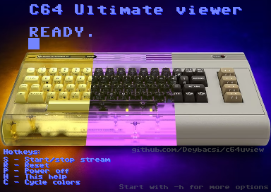

# C64 Ultimate viewer for linux

Simple video & audio stream viewer for the new C64 Ultimate owners.

The project is a fork of [Dusted's U64view](https://github.com/dusteddk/u64view/) to have a working linux streamer for C64 Ultimate. 

For Windows check "U64 Streamer" made by Martijn Wieland (TSB) -> https://www.tsb.space/projects/u64-streamer/




## How to use

The best way is to start with `-I` because this will leave the stream on the C64U as it is was originally.
Press `S` key to start or stop the streaming.
```
./c64uview -I 192.168.0.64
```
If the stream was turned on on C64U side, then the playback will start automatically.
After exit, the viewer will not stop the stream.

During viewing, you can always press `h` for the help screen.

**You can get useful help when starting with:**
```
./c64uview -h
```

## Compiling

Before compiling you need to install:

### Debian/Ubuntu/Mint:
```
sudo apt install libsdl2-dev libsdl2-net-dev gcc make build-essential
```


### Compile:

Execute `./compile.sh` or run manually:
```
make clean
make all
```
It will make a new `c64uview` executable for you in the current folder.


## Defaults

Listens for 
- video on port 11000
- audio on port 11001

## Changelog

You can check the [changelog here](CHANGELOG.md)

## Official page
https://github.com/Deybacsi/c64uview
